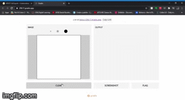

# MINST-GUI
Handwritten Digit Recognition GUI

## Demo

## About
- The aim of this Assignment was develope a minst model which can recognise hand written digits and then integrate with an inline GUI(Gradio). 

## What is Gradio

